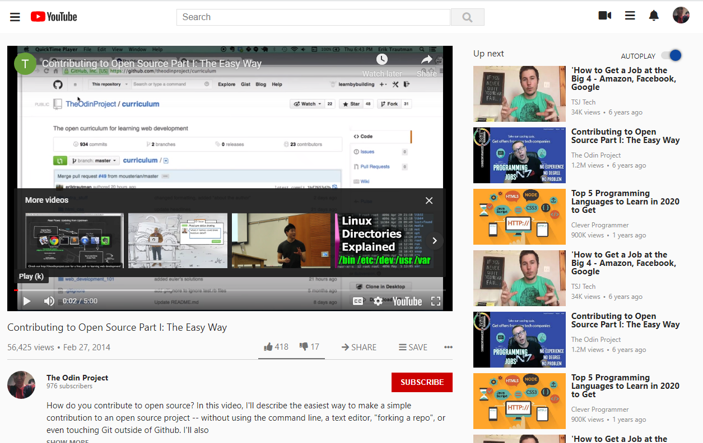

# This is a Youtube homepage clone

> The project is a clone of the youtube homepage build for [TheOdinProject](https://www.theodinproject.com/). Enjoy your videos!

- I build this project as a requirement to pass the TheOdinProject modules.
- The web app is mobile responsive.

## Built With

- HTML,
- CSS,
- JS

## Live Demo

[Live Demo Link](https://cristianceamatu.github.io/theOdinProject-youtubeclone/)

To get a local copy up and running follow these simple example steps.

### Setup

Clone the project locally.

### Deployment

Install and run a live server plugin on you IDE/Text editor and run it from the root directory.

## Authors

👤 **Cristian Viorel Ceamatu**

- Github: [@githubhandle](https://github.com/cristianCeamatu)
- Twitter: [@twitterhandle](https://twitter.com/CeamatuV)
- Linkedin: [linkedin](https://www.linkedin.com/in/ceamatu-cristian-viorel-7a5469136/)

## Show your support

Give a ⭐️ if you like this project!

## 📝 License

This project is [MIT](lic.url) licensed.
